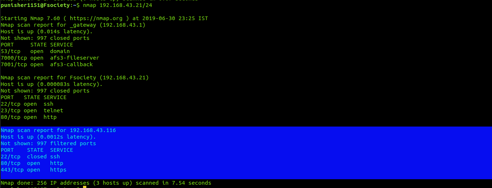
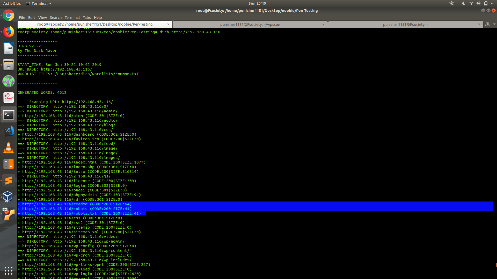

# MrRobot-VM Writeup

## First Key
On Starting VM we are asked Login-Credentials.
+ Tried : admin:admin; root:toor; Elliot:elliot... none of them worked
+ Now ran nmap to scan for any Host Discovery 
```
nmap 192.168.43.21/24
```
+ Found a HOST up at 192.168.43.116 with http and https service


+ opened 192.168.43.116 in browser which followed a wordpress site.
+ Site produced some gibberish text and clips from Mr-Robot Series.
+ Also checked HTML but no Lead found 
+ Then I scanned site using dirb (it scans website directory folders for us). 



+ The robots, readme, robots.txt seems intersting I opened using url
```
192.168.43.116/robots.txt
```

+ Found another two files name another is probably the first key.
```
192.168.43.116/key-1-of-3.txt
```
+ Voila !! it displayed FIRST KEY
```
073403c8a58a1f80d943455fb30724b9
```
