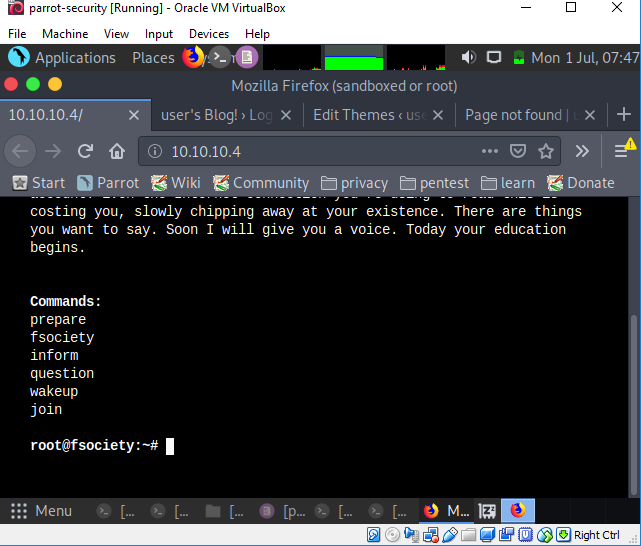
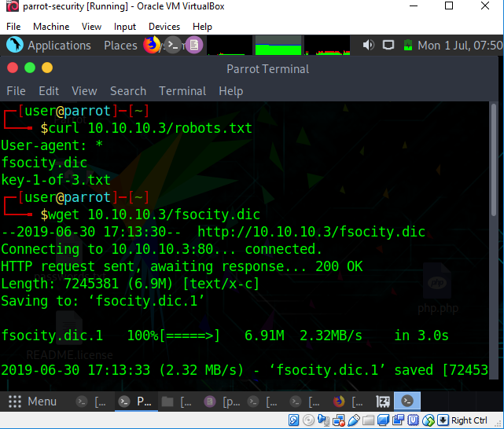
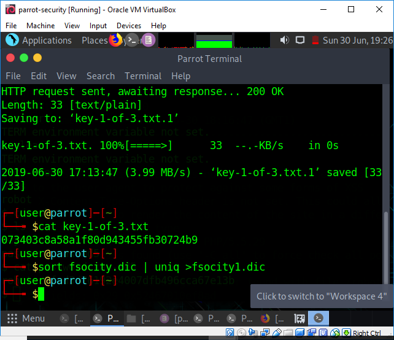

## MR.ROBOT  VM 

## Objective
Finding key 1

## Solution

first we need to setup the mr.robot vm and our attacker vm . 
i am using parrot os as my attacking vm and two target vm(mr.robot vm)(we can work with  one target also but i am using two ) and oracle as virtual box.


we will assign ip to the vm by  setting up dhcp server .

let's us first create internal  network for them.
for each vm  do following:

- right click on vm and select "settings".
- go to "network" tab and select "internal network".
- name the network anything(here i named it "test").
- click ok.

Now for dhcp server open cmd and change directory to the one containing vboxmanager.
type following command: 

```
vboxmanage dhcpserver add — netname test — ip 10.10.10.1 — netmask 255.255.255.0 — lowerip 10.10.10.2 — upperip 10.10.10.12 — enable

```

Ok,Now ip is assigned launch all three vm.

open attacker vm(parrot).

open up the terminal and let's see the assigned ip of the machine.
type command:
```
ifconfig
```
result:ip is 10.10.10.2
so the assinged ip of target vm will be 10.10.10.3 and 10.10.10.4.

now let's open the target ip in browser.



not so much information .

we will use  nikto now to enumerate.

```
nikto -host 10.10.10.4

```


seeing the result it shows robots.txt ,let's see what it will give.

```
curl 10.10.10.3/robots.txt
```


it contains our key 1 and a .dic file let's download both.
```
 wget 10.10.10.3/key-1-of-3.txt
 wget 10.10.10.3/fsocity.dic
```
opening key-1-of-3.txt give
```
cat key-1-of-3.txt
```

key 1=073403c8a58a1f80d943455fb30724b9

