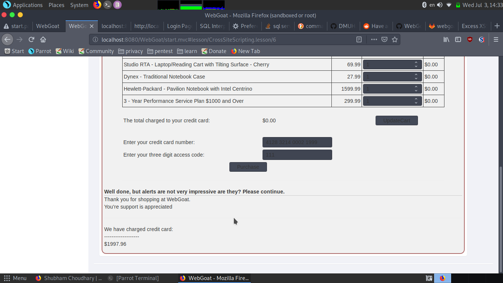
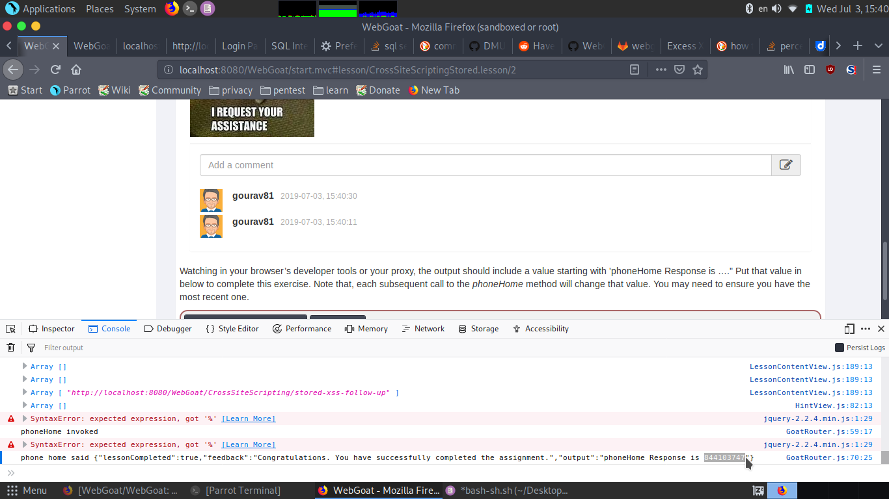

## Objective

Complete XSS

## Solution

i)Cross Site Scripting

2.seeing the cookies they are same.

7.we need to find out field susceptible to XSS.

first four field show red indication on pasting 
on credit card no. we did't get error.

10.as it says we need to see the source code . seeing the source of goatrouter.js

![]xss10r.png

we see test just like lesson.lesson has route start.mvc#lesson/
so test will have route start.mvc#test/

![]xss10.png

11. as it says use the previous route we will use it and it says via url.
so type 
http://localhost:8080/WebGoat/start.mvc#test/

copying that response we get success.

