## Objective

Complete Access Control flow

## Solution

i) Insecure Direct Object References

2.simply use tom as user and pass- cat.

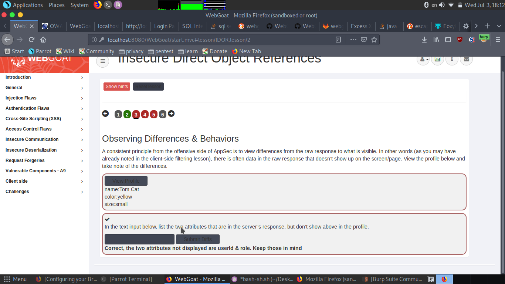

3.as we need to see raw response open burpsuit
turn the intercept on.

now click on the view profile tab,forward the request and see the response.

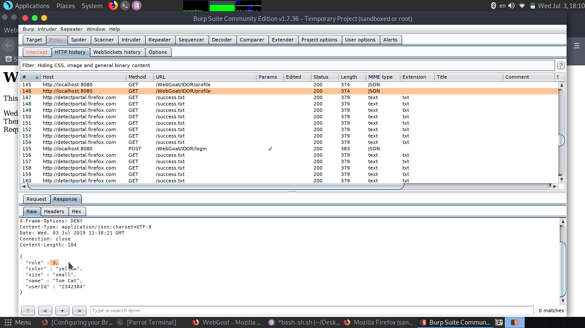

in response we see extra field userid and role.
so submit userid,role

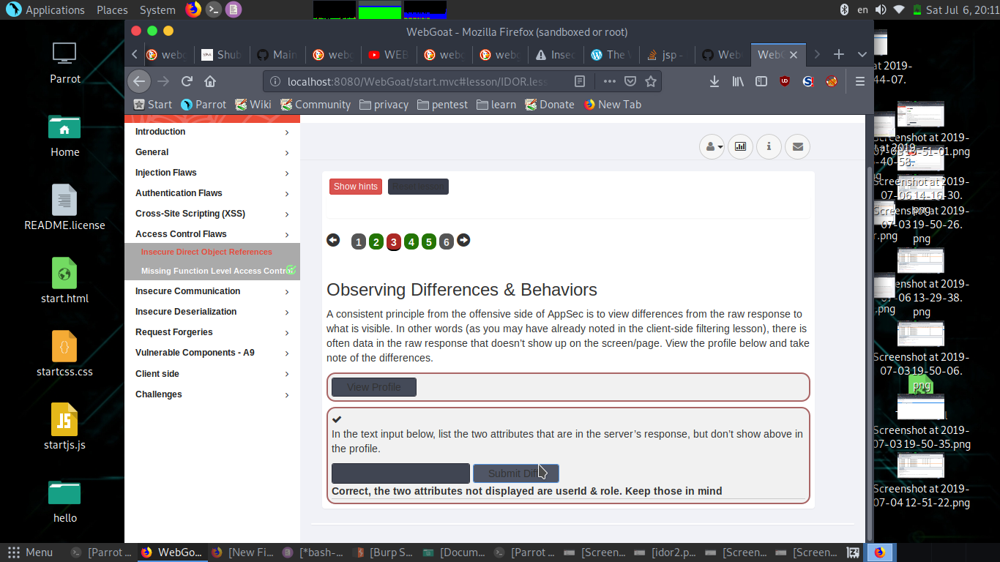

4.use burpsuit.
seeing the response of the request we see path =WebGoat/IDOR/profile/userid

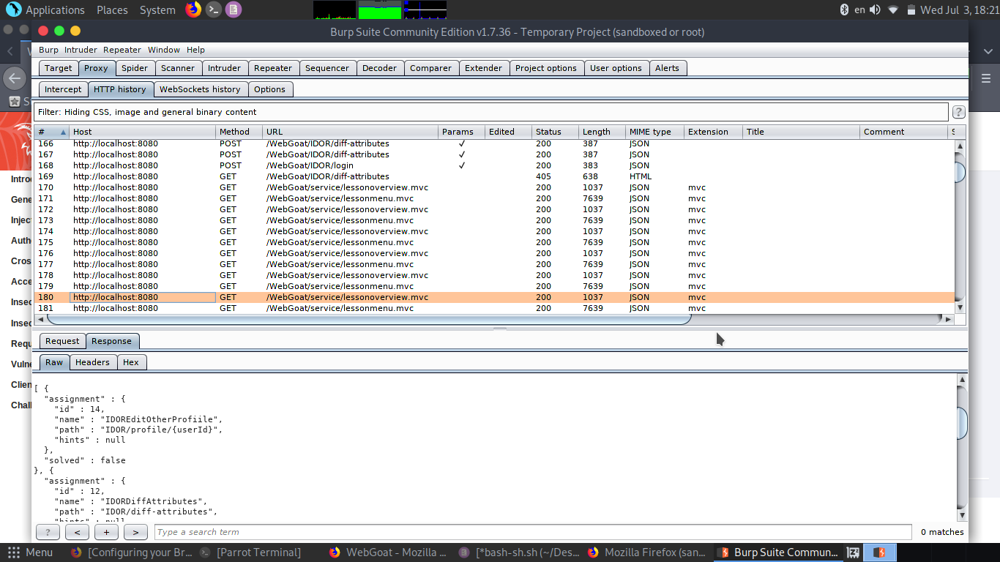

so use the userid we got in previous request(2342384).

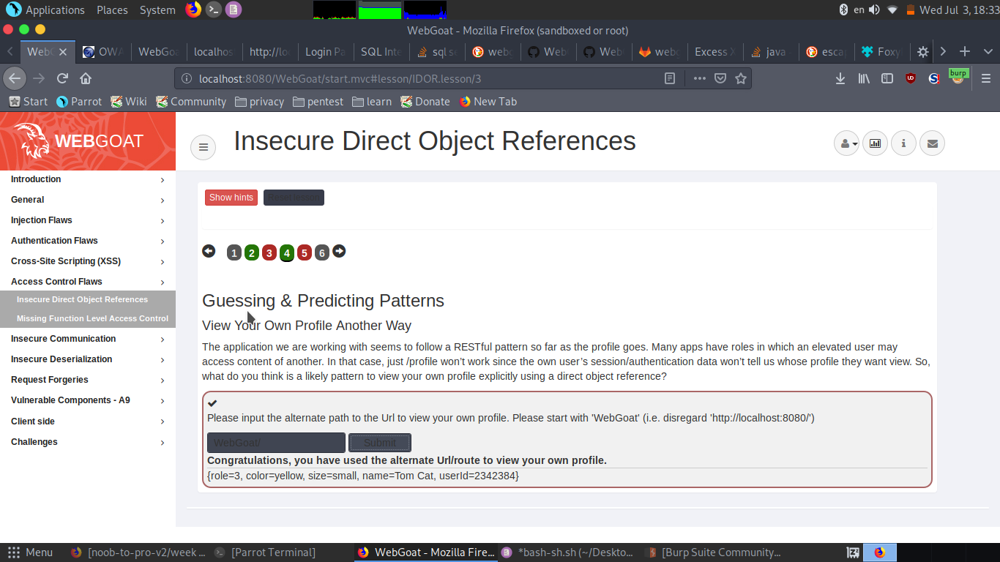

5.click on view profile and see the response in burpsuit it gives tom profile.

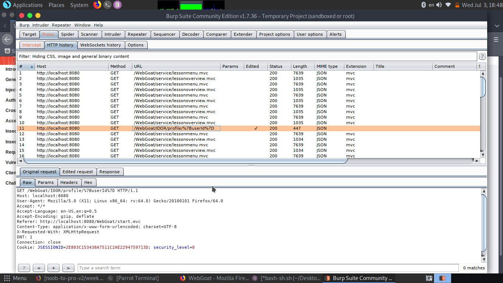

we can see that or request is of type profile/userid.

so try different userid by increment tom's userid in our get request.(like profile/2342385 )
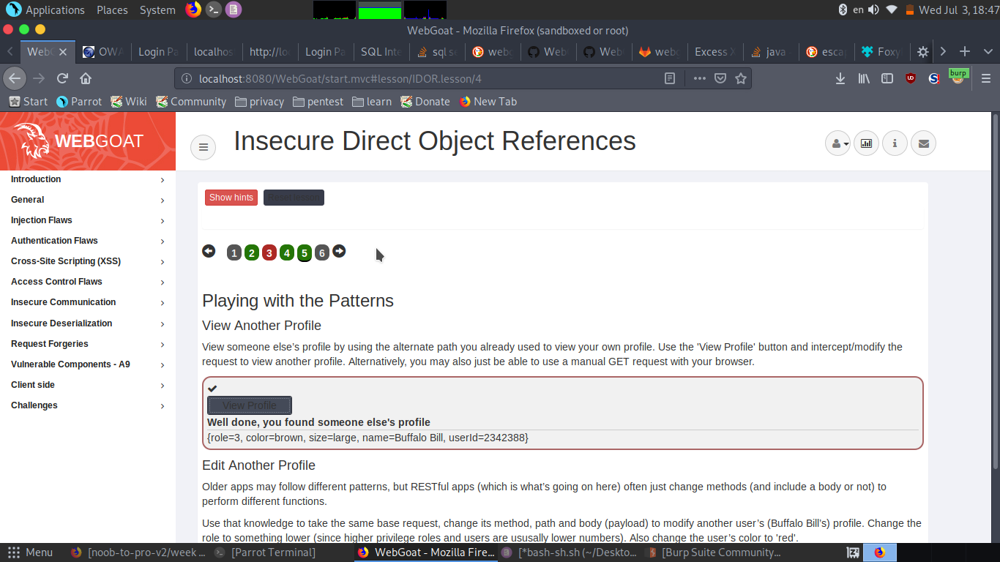

at userid 2342384  we get buffalo bill id.

ii) Missing Function Level Access Control.

2.seeing the first point it says we can find hidden items in html source code.
so after searching in it in class menu section hidden-menu item 

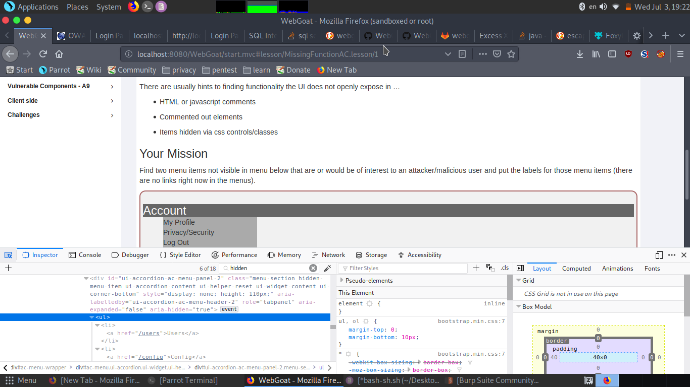

we see /users and /config

entering both in field we get

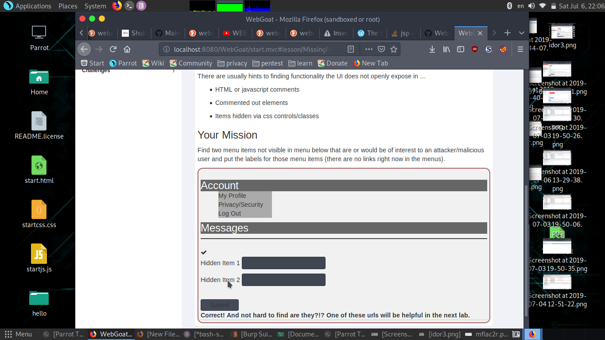

3.in prevoius we got the message " One of these urls will be helpful in the next lab."
so let's open the users link (webgoat/users).

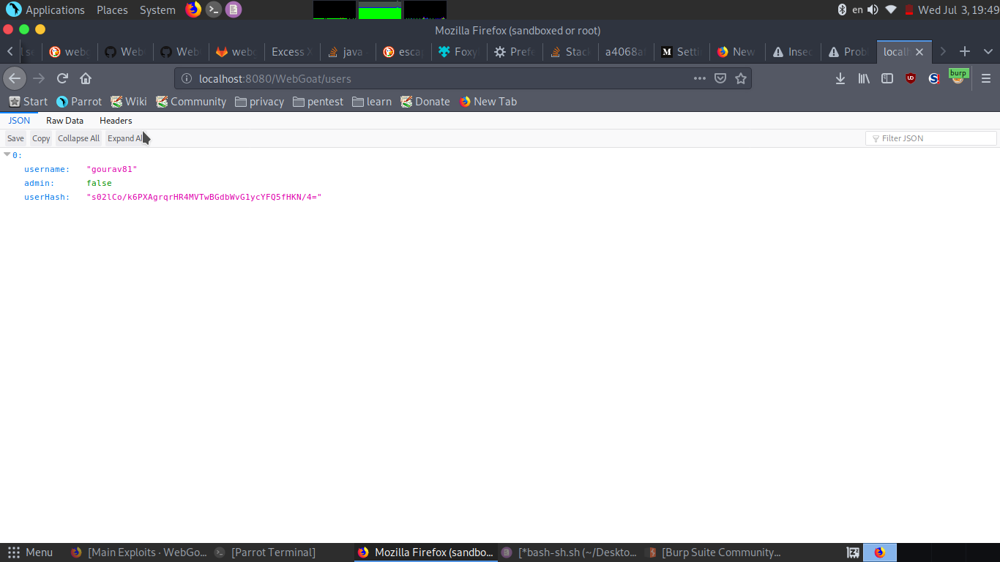

copying that hash in your hash field.

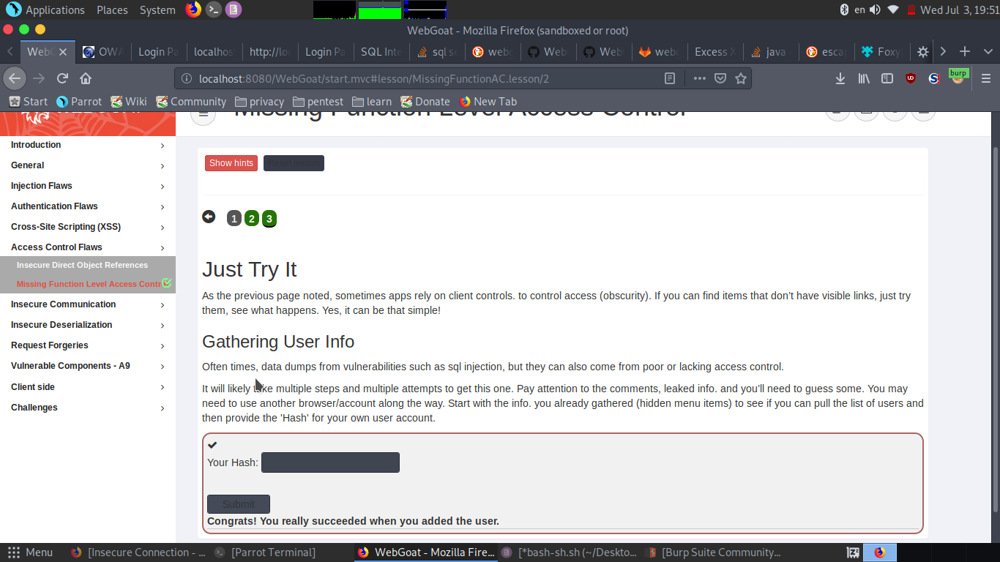

