## Objective

Complete Request Forgerie

## Solution

i) Cross-Site Request Forgeries

3.click on submit query .
it says success:false
now seeing the url we see csrf=false
changing it to true

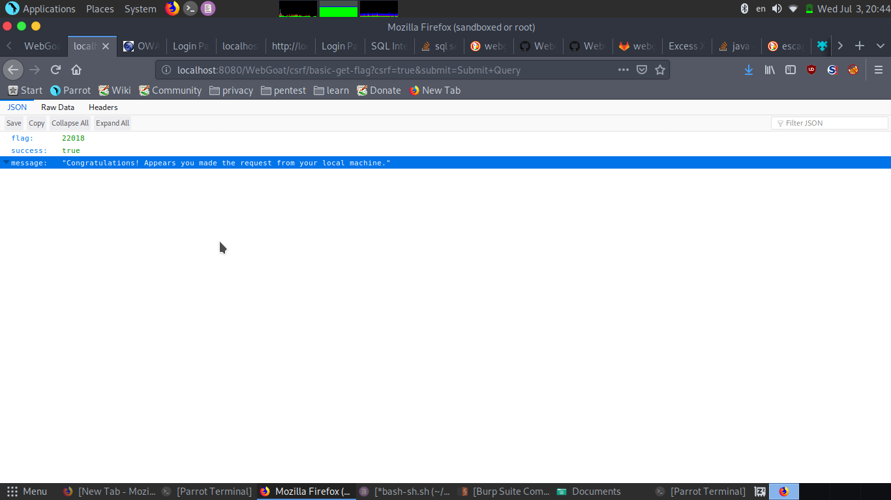

it says success :true
got flag:22018

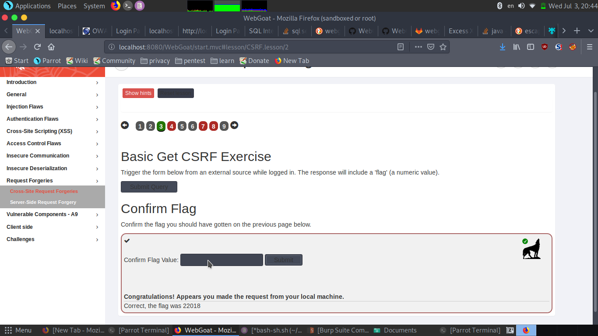

4.as it says request using extenal source. we will use burp  . first turn on the intercept and click on submit review.
seeing the request it contains a Validreq ,stars,reviewtext.we will use the cookie(jsessionid) and do the same request,

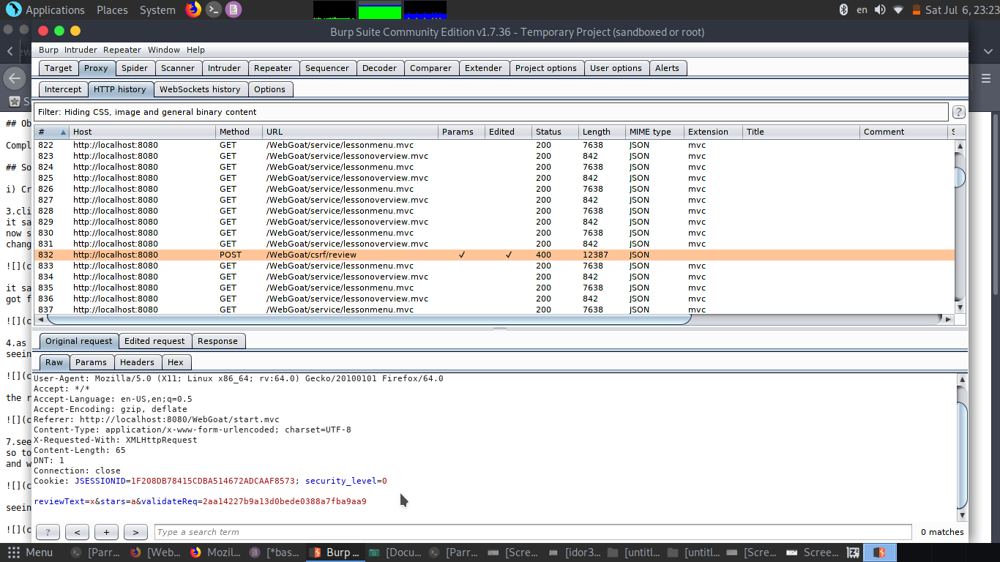

the response is lessoncompleted=true

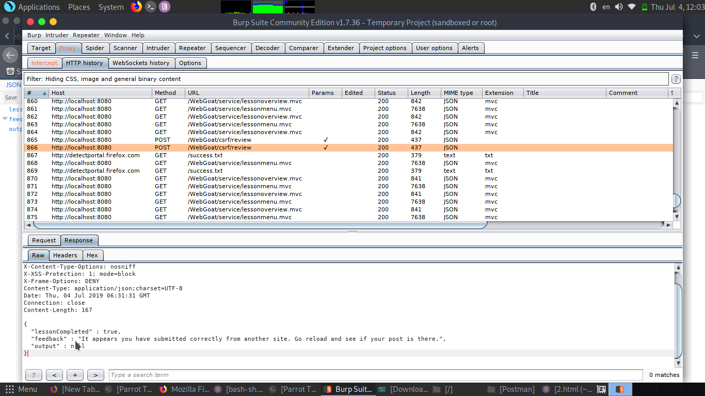

7.seeing the hint it says see content type.open burp suit and intercept the request we see content-type :json
so to post the required content we will do similar to previous one. and in our request we will use content-type :plain-text
and will name and rest like the image below.

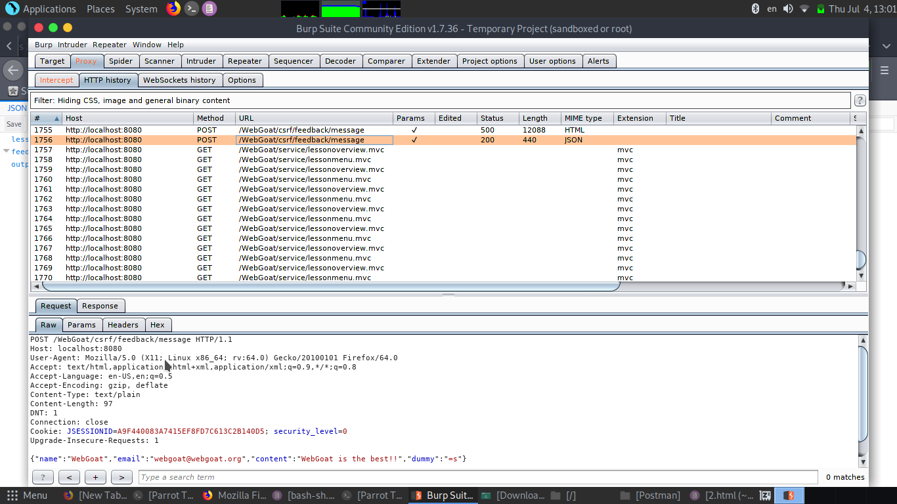

seeing the response it contains the flag.

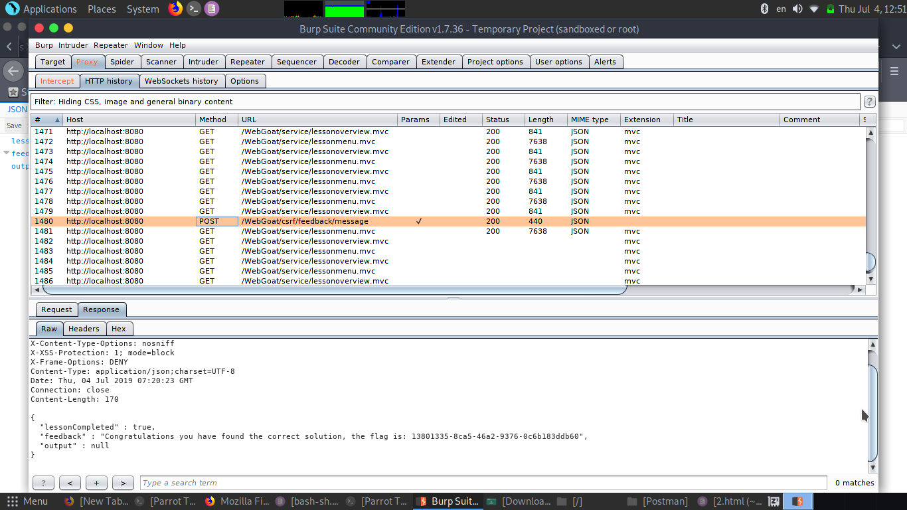

8.seeing the hints it says First create a new account with csrf-username
so i have user =gourav81
now i will make account using csrf-gourav81.
after that go to same task then click solved.
we succed.

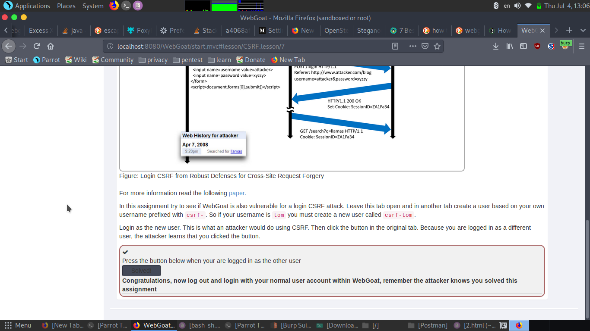

ii)Server-Side Request Forgery

2.as the task says to change the url we will do that exactly. using burpsuit intercept the request .
we see it have a url .
so replace tom with jerry (as we need jerry)

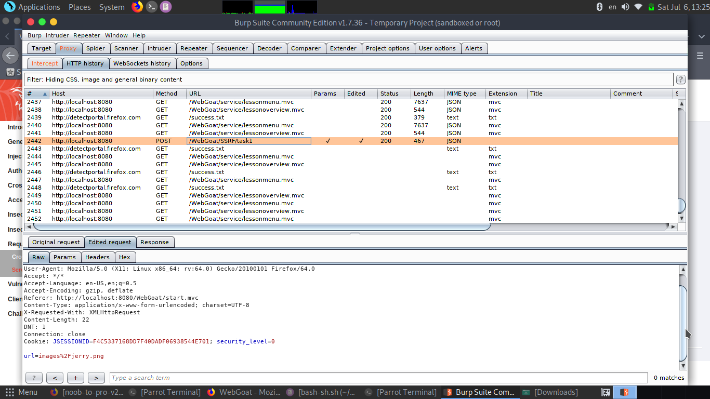

forward the request.

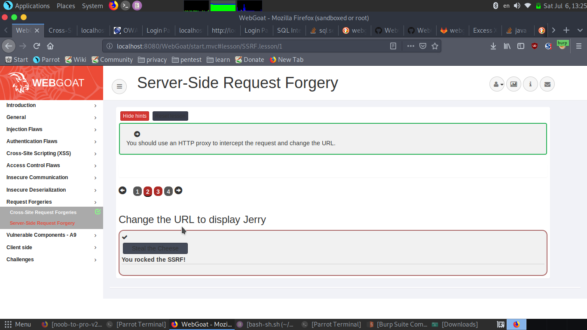

3.seeing the hint it says add http://
we will do exactly same as previous .we need ifconfig.pro so add url in request to http://ifconfig.pro
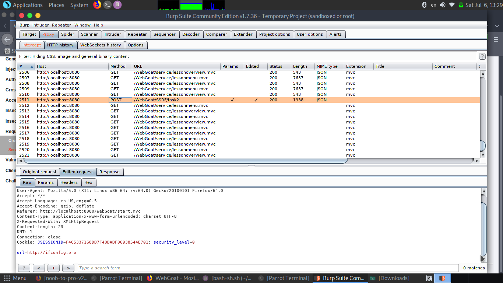

forward the request.

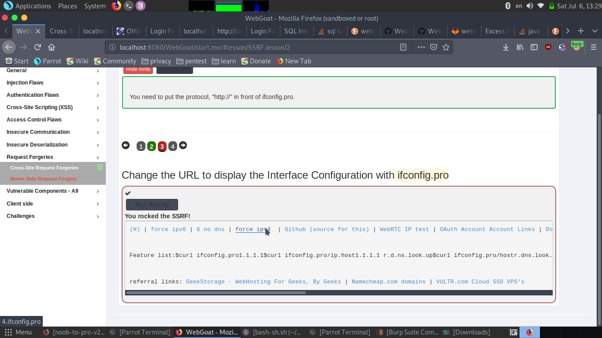

