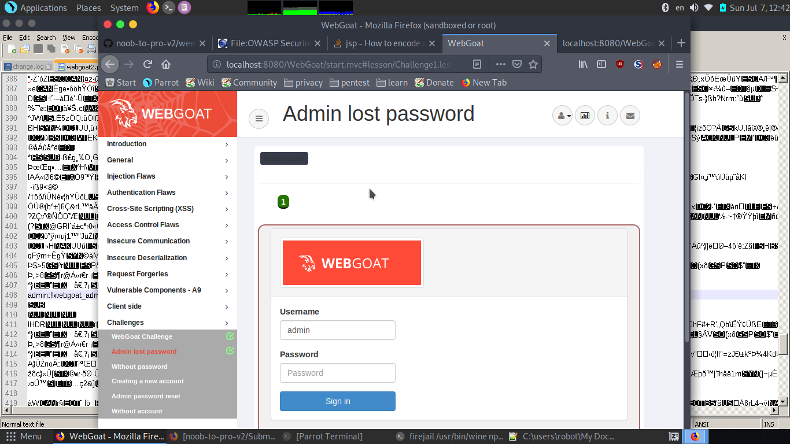
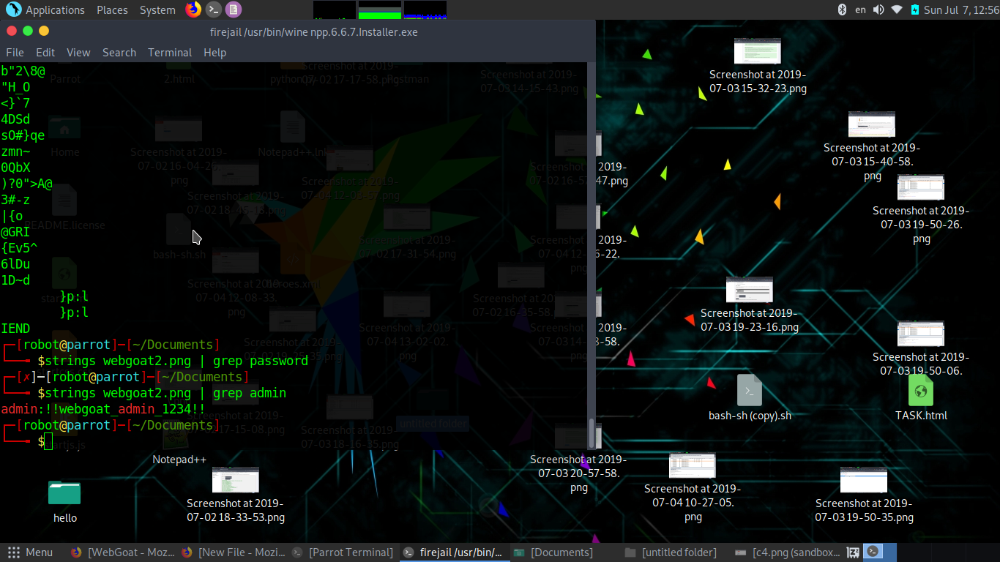
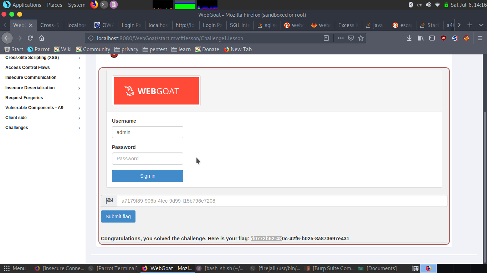
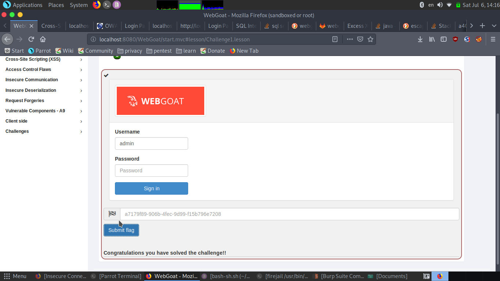

## Objective

Admin lost password

## Solution

download the webgoat image on the webpage.



now see the image using strings .

```
strings webgoat2.png

```

seeing the output of the command it contains unreadable content .but going through the complete content we find the password.

alternatively try to use grep .

```
strings webgoat2.png | grep admin

```



on using grep admin we get the something which is the  password.

password:!!webgoat_admin_1234!!


entering that in the password field we get



the flag

on entering the flag



challenge solved.
