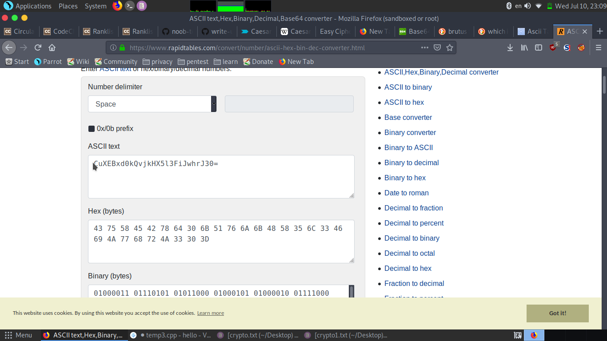
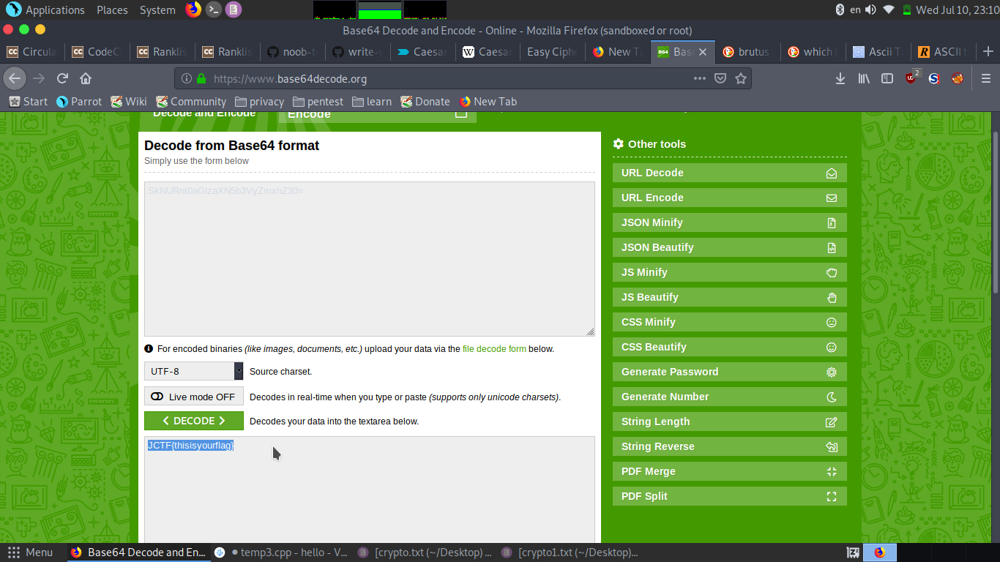

## Statement

open your ii's you can c everything on the table.after you c tell brutus best friend hello and to  take 10 steps forward .then  play the base of no.64  .  

## Difficult:Medium

## Solution
 
 The file contain no. these are ascii's value using online ascii's converter we get " CuXEBxd0kQvjkHX5l3FiJwhrJ30="

now brutus friend was caesar so caesar cipher using 10 shift decoding we get "SkNURnt0aGlzaXN5b3VyZmxhZ30="
 

now it says base 64 ,using base64 decoder we get the flag.
 

## Flag

JCTF{thisisyourflag}
 
 

