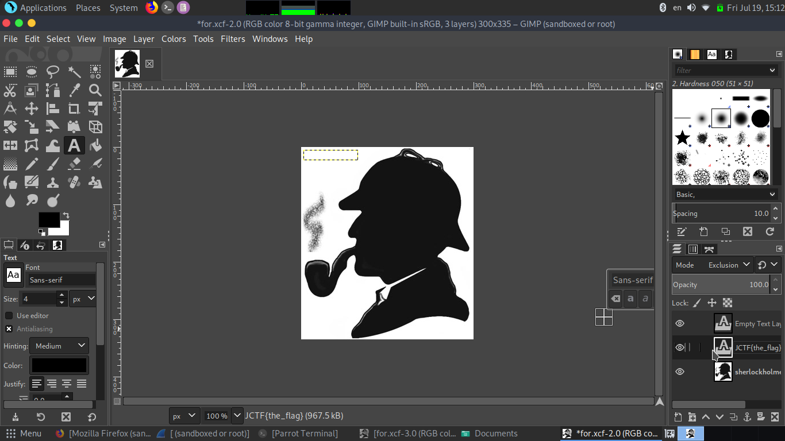

## Statement
Your eyes tells  lies.


## Difficulty : medium

## Solution

the actual file is xcf not png it has been edited .
using file 
```
file for.png
for.png: GIMP XCF image data, version 011, 300 x 335, RGB Color

```
so converting it to .xcf
and opening it with GNU IMP 



the image contains text field which says JCTF{the_flag}.

## Flag
  JCTF{the_flag}


