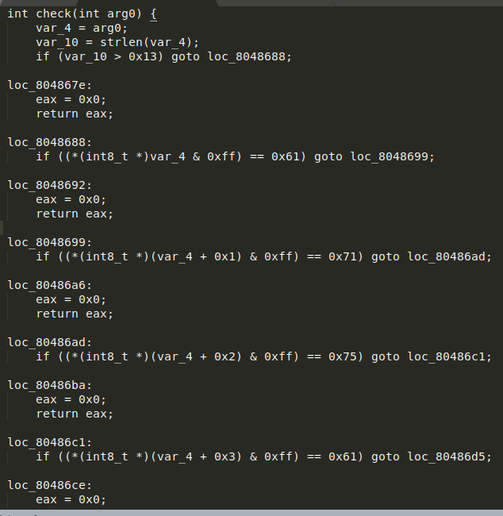
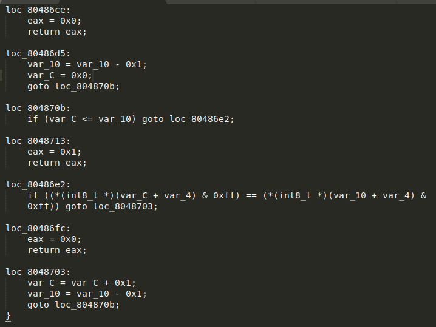

Yes code looks pretty long 
just focus on comparison part we break point near comparison 
print value of $ebp-0x2c 

it contains our passed string so we concentrate on check function to not return 0x0
1) check string len > 0x13
2) takes first character compare it to 0x61 = 'a'
3) takes second character compare it to 0x71 = 'q'
4) takes third character compare it to 0x75 = 'u'
5) takes fourth character compare it to 0x61 = 'a'
 
it becomes aqua 
then there is a loop  
 
with one index(i) on start and index(j) at end  
if any time character at i does not maches char at index j it return 0x0  
loop break when i passes j  
so our password needs to be a plandirome  
## password='aquaaaaaaaaaaaaaauqa'
