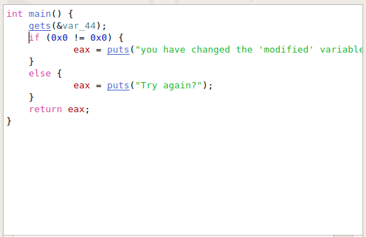

we check source code using hopper 
 
although it shows 0x0!=0x0 which comparison can never pass 
but if a comparison can never pass it will not be included by compiler 
actually it is comparisong b/w some variable not equal to zero  
since program takes input using 'gets' and 'gets' doesnot takes amount of characters  to input so we overwrite the variable by changing  length of input string and it overwrites it for length>65  

