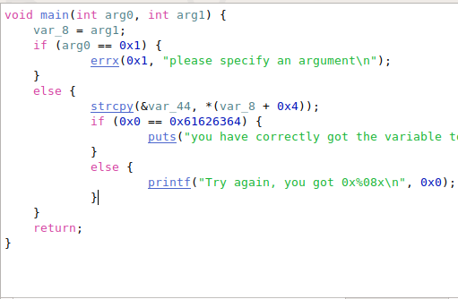
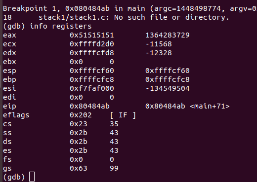

program uses strcpy to copy characters starting leaving first four 
 
we run function with fairly large string with distinct 4 letter characters   'AAAABBBBCCCCDDDDEEEEFFFFGGGGHHHHIIIIJJJJKKKKLLLLMMMMNNNNOOOOPPPPQQQQRRRRSSSSTTTTUUUUVVVVWWWWXXXXYYYYZZZZ'  
now pipe this output to file and give this file as input to program 
 and break point at comparison check the value of eax 
 
0x51 is hex of 'Q' 
so we print 64 characters then value eax is compared to that is '\x64\x63\x62\x61' 
that is 'dcba' 

