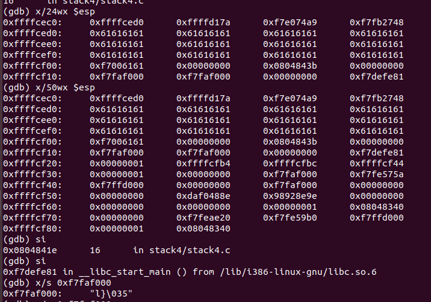
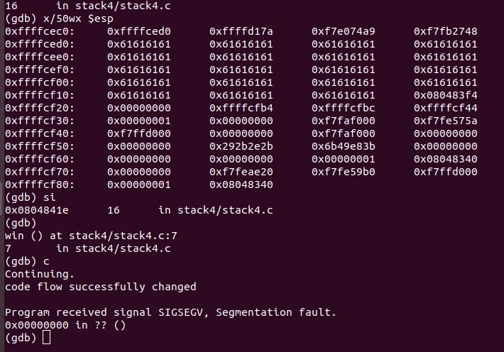

this program simply gets our input using 'gets' so clearly we control the stack the stack now<br/>
we pass a long string and examine stack<br/>
<br/>
we step instruction it executes <br/>
```
0xf7defe81 in __libc_start_main () from /lib/i386-linux-gnu/libc.so.6
```
from stack we overwrite its position with call to win function address 0x80483f4 <br/>
<br/>
and control flow changes<br/>

