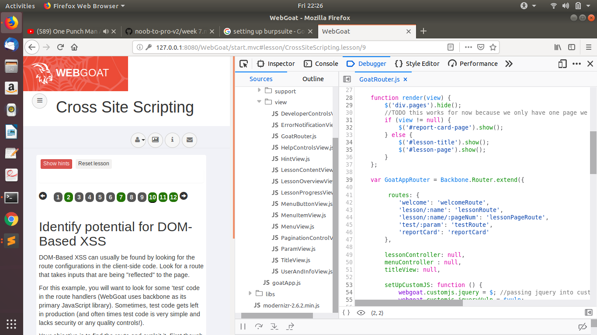

## Cross site scripting

### Reflected XSS
credit card field is vulnerable to xss  

### DOM-Based XSS
  
checking JavaScript Source there is GoatRouter.js  
containing path 'start.mvc#test/'paramter passed is reflected back

### DOM-Based XSS
we call url `localhost:8000/WebGoat/start.mvc#test/`

